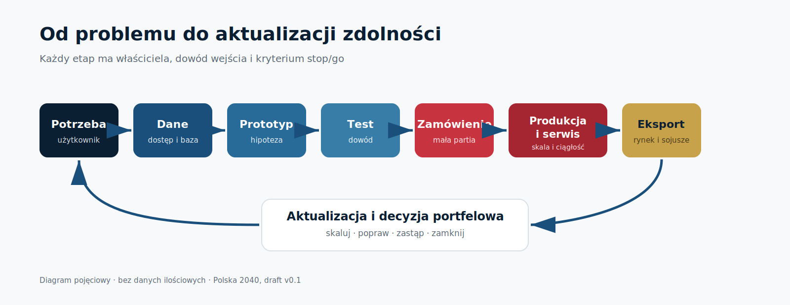

# Polska 2040: Suwerenność technologiczna

**Projekt narodowego programu systemów autonomicznych, AI i technologii podwójnego zastosowania** 
**Status:** niezależny, bezpartyjny materiał przedmandatowy v0.1 do konsultacji eksperckich; nie jest formalnym przedłożeniem rządowym 
**Stan wiedzy:** 21 lipca 2026 r. 
**Horyzont decyzji:** 2026–2040

> Dokument nie jest strategią rządową ani stanowiskiem jakiejkolwiek instytucji państwa. Opiera się wyłącznie na źródłach jawnych. Nie opisuje zdolności niejawnych, parametrów operacyjnych ani sposobów budowy lub użycia uzbrojenia.

## Executive Summary / Streszczenie wykonawcze

### Odpowiedź w jednym zdaniu

Polska powinna zbudować ponadresortowy **system realizacji suwerenności technologicznej**, który łączy potrzeby użytkowników, bezpieczne dane, szybkie testy, iteracyjne zamówienia, produkcję, serwis, kadry, finansowanie i eksport — zamiast tworzyć pojedynczy program dronowy, nową uczelnię albo państwową megafabrykę.

### Dziesięć tez strategicznych

1. **Problem jest systemowy, nie edukacyjny.** Większa liczba absolwentów nie przełoży się na zdolności państwa, jeżeli nie istnieją problemy do rozwiązania, dane, środowiska testowe, zamówienia, kapitał, produkcja oraz perspektywa atrakcyjnej pracy.
2. **Suwerenność nie oznacza autarkii.** Celem jest kontrola krytycznych interfejsów, konfiguracji, danych i cyklu życia, znajomość zależności oraz zdolność zastąpienia dostawcy lub zwiększenia produkcji w kryzysie.
3. **Zakres musi wykraczać poza statki powietrzne.** Program obejmuje systemy powietrzne, lądowe, nawodne i podwodne, przeciwdziałanie systemom bezzałogowym, sensory, łączność, WRE/SIGINT, cyber, AI, logistykę, serwis, komponenty i zastosowania cywilne — na poziomie polityki technologicznej, bez ujawniania parametrów operacyjnych.
4. **Potrzeba użytkownika poprzedza grant.** Portfel zaczyna się od jawnej części problemu publicznego i kontrolowanej części wymagań, a kończy decyzją o skalowaniu albo zamknięciu projektu.
5. **Dane i testy są infrastrukturą strategiczną.** Bez bezpiecznej przestrzeni danych, wspólnych metod ewaluacji i dostępu do laboratoriów oraz poligonów nie da się szybko porównywać rozwiązań.
6. **Produkcja ma być rozproszona i rekonfigurowalna.** Państwo powinno budować sieć integratorów, dostawców komponentów, serwisu i rezerw mocy, nie jedną fabrykę jednej generacji produktu.
7. **Współpraca z Ukrainą jest przewagą, ale nie może tworzyć zależności od jednego partnera.** Potrzebne są portfolio partnerstw, due diligence, rozdzielenie IP, kontrola eksportu, depozyt dokumentacji i ciągłość działania.
8. **Program wymaga mandatu przy centrum rządu.** Biuro realizacji koordynuje portfel i eskaluje konflikty, lecz ministrowie zachowują ustawowe kompetencje i odpowiedzialność za wykonanie.
9. **Wydatki muszą kupować zarówno bezpieczeństwo, jak i zdolność gospodarczą.** Kontrakty, kapitał, gwarancje i granty pełnią różne funkcje; każdy instrument ma koszt alternatywny, warunek zakończenia oraz miernik rezultatu.
10. **Wersja v0.1 nie zamraża budżetu ani wolumenów.** Cele ilościowe stają się zobowiązaniem dopiero po audycie wartości bazowych, zobowiązań już istniejących, kosztów i zdolności wykonawczej.

### Decyzja rekomendowana

Kandydat decyzji **DEC-0001** zakłada, że Rada Ministrów uruchomi sześciomiesięczny przegląd strategiczny. Powiązane kandydaty **DEC-0002–DEC-0005** obejmują ograniczony portfel działań odwracalnych: formalne wskazanie właściciela, audyt przemysłu i kadr, katalog problemów, pilotaż bezpiecznej przestrzeni danych, wspólny standard testów oraz pierwsze małe zamówienia z jednoznaczną bramką skalowania. Prezydent i BBN mogą wspierać ciągłość strategiczną, zgodność z NATO i coroczny przegląd odporności państwa, bez przejmowania kompetencji wykonawczych rządu. Wszystkie rekordy `DEC-*` pozostają kandydatami do czasu rozstrzygnięcia właściwości, podstawy procesu i relacji do obowiązujących strategii (**GAP-0011**).

### Co już potwierdzają źródła jawne

- Polska podpisała 8 maja 2026 r. umowę pożyczki SAFE o wartości 43,7 mld EUR i jest największym beneficjentem instrumentu; nie oznacza to wypłaty całej kwoty ani bezzwrotnej dotacji ([Ministerstwo Finansów](https://www.gov.pl/web/finanse/podpisanie-umowy-pozyczki-z-instrumentu-safe), **CLM-1208**).
- KPRM deklaruje, że 89% funduszy SAFE ma trafić do polskiego przemysłu i gospodarki; jest to plan, nie zmierzony wynik wykonania ([KPRM](https://www.gov.pl/web/premier/nowe-zdolnosci-wojska-polskiego-dzieki-programowi-safe---lista-zadan), **CLM-1209**).
- Polska jest już wymieniona przez EDA jako uczestnik BraveTech EU, inicjatywy o łącznym budżecie 100 mln EUR; właściwą decyzją nie jest więc „wejście”, lecz określenie polskiego portfela i mierników korzyści ([EDA](https://eda.europa.eu/news-and-events/news/2026/04/29/eda-partners-with-the-european-commission-on-bravetech-eu), **CLM-1213**, **CLM-1214**).
- Umowa bezpieczeństwa Polska–Ukraina tworzy ramy dla łańcuchów produkcyjnych, wyboru lokalizacji, wspólnej produkcji i ochrony IP, ale nie ustanawia konkretnej spółki ani produktu ([Prezydent Ukrainy](https://www.president.gov.ua/en/news/ugoda-pro-spivrobitnictvo-u-sferi-bezpeki-mizh-ukrayinoyu-ta-92009), **CLM-1212**).
- Polska polityka AI przewiduje rozwój Piast i Gaia AI Factory, vouchery PLGrid oraz piaskownice regulacyjne (**CLM-1217**). **INFERENCE o ograniczonym zakresie dokumentu:** w tym jawnym dokumencie polityki nie zdefiniowano kompletnego obronnego stosu danych i modeli (**CLM-1218**); nie dowodzi to braku rozwiązań MON ani innych zdolności niejawnych ([Ministerstwo Cyfryzacji](https://ai.gov.pl/media/2025/11/Polityka-rozwoju-sztucznej-inteligencji-w-Polsce-do-2030-roku-17.11.2025__-1.pdf)).
- NATO utrzymuje sześć zasad odpowiedzialnego użycia AI: legalność, odpowiedzialność i rozliczalność, wyjaśnialność i identyfikowalność, niezawodność, sterowalność oraz ograniczanie stronniczości ([NATO](https://www.nato.int/en/about-us/official-texts-and-resources/official-texts/2024/07/10/summary-of-natos-revised-artificial-intelligence-ai-strategy), **CLM-1220**).

Te fakty pokazują dostępne ramy i instrumenty. Nie dowodzą jeszcze, że Polska ma zintegrowany system realizacji, wystarczające moce produkcyjne ani osiągnięte rezultaty. Ustalenie rzeczywistego stanu jest pierwszym produktem programu, nie założeniem dokumentu.

## Spis treści

[TOC]

## 1. Mandat, zakres i definicje

### 1.1. Problem publiczny

Polska dysponuje wieloma elementami potrzebnymi do rozwoju technologii podwójnego zastosowania: przemysłem, uczelniami, instytutami, zamówieniami publicznymi, finansowaniem krajowym i europejskim oraz dostępem do doświadczeń sojuszników. Nie wynika z tego automatycznie spójna zdolność państwa. Fragmentacja odpowiedzialności może powodować, że:

- potrzeba użytkownika nie jest przetłumaczona na problem możliwy do rozwiązania przez rynek;
- firma nie uzyskuje bezpiecznego dostępu do danych i środowiska testowego;
- prototyp nie ma ścieżki do małej partii i informacji zwrotnej;
- zamówienie premiuje zamrożoną specyfikację, gdy technologia wymaga iteracji;
- finansowanie badań nie prowadzi do produkcji, serwisu i eksportu;
- państwo nie zna krytycznych zależności komponentowych ani czasu ich substytucji;
- edukacja reaguje na modę technologiczną zamiast na zweryfikowany popyt kompetencyjny;
- obiecujące zespoły przenoszą rozwój i własność intelektualną poza Polskę;
- nieskuteczne projekty trwają, ponieważ system nagradza rozpoczęcie, a nie zakończenie.

Strategia odpowiada na tę lukę realizacyjną. Nie zastępuje strategii bezpieczeństwa narodowego, planowania obronnego, polityki przemysłowej, polityki AI ani decyzji zakupowych. Tworzy wspólną architekturę wykonania i mierzenia rezultatów między nimi.

### 1.2. Definicja suwerenności technologicznej (`DEF-0001`)

Na potrzeby programu **suwerenność technologiczna** oznacza zdolność państwa i gospodarki do:

1. podejmowania decyzji o konfiguracji i wykorzystaniu krytycznych systemów zgodnie z polskim prawem i zobowiązaniami sojuszniczymi;
2. utrzymania usług i zdolności w przypadku zakłócenia dostaw, aktualizacji, łączności lub wsparcia producenta;
3. rozpoznawania zależności w komponentach, oprogramowaniu, danych, kompetencjach i serwisie;
4. zastępowania krytycznych dostawców w akceptowalnym czasie albo posiadania kontrolowanego zapasu i planu ciągłości;
5. testowania, naprawiania, aktualizowania i skalowania systemu w Polsce lub w zaufanym ekosystemie sojuszniczym;
6. zachowania dostępu do niezbędnej dokumentacji, interfejsów, kluczy procesowych i historii konfiguracji;
7. dzielenia ryzyka i korzyści z partnerami bez utraty kontroli nad interesem publicznym.

Definicja jest relacyjna: różne klasy technologii wymagają różnego poziomu kontroli. Dla jednych wystarczy wielu zaufanych dostawców, dla innych konieczna będzie zdolność krajowej integracji, naprawy lub produkcji awaryjnej. Strategia nie zakłada krajowego wytwarzania każdego procesora, sensora czy materiału.

### 1.3. Zakres technologiczny

Program obejmuje osiem powiązanych warstw:

| Warstwa | Zakres polityki | Poza zakresem dokumentu jawnego |
|---|---|---|
| Platformy | systemy powietrzne, lądowe, nawodne i podwodne | parametry misji i podatności |
| Przeciwdziałanie | wykrywanie, identyfikacja, ochrona i neutralizacja w ramach prawa | rozmieszczenie i konfiguracje operacyjne |
| Sensory i elektromagnetyzm | optyka, RF, sensory pasywne, WRE/SIGINT na poziomie zdolności przemysłowej | częstotliwości, biblioteki sygnałów, charakterystyki niejawne |
| Łączność i nawigacja | odporne, modułowe interfejsy i alternatywy dla pojedynczych zależności | szczegóły kryptograficzne i procedury użycia |
| AI i dane | fuzja danych, percepcja, wsparcie decyzji, autonomia, ewaluacja modeli | zbiory operacyjne i reguły zaangażowania |
| Cyber i software | bezpieczny cykl wytwarzania, aktualizacje, SBOM, testy i reakcja | konkretne podatności nieusuniętych systemów |
| Produkcja i cykl życia | komponenty, integracja, serwis, naprawy, logistyka, utylizacja | rzeczywiste zapasy i moce wrażliwe |
| Zastosowania cywilne | przemysł, energia, rolnictwo, transport, ratownictwo, środowisko | dane chronione i bezpieczeństwo infrastruktury |

### 1.4. Horyzonty

- **Pierwsze 100 dni:** ustanowienie właścicieli, reguł, audytów i pilotaży odwracalnych.
- **Do 12 miesięcy:** pierwsze dane porównawcze, testy użytkownika, małe partie, model finansowy i decyzje legislacyjne.
- **2027–2030:** skalowanie potwierdzonych mechanizmów, rozwój komponentów i usług cyklu życia, integracja z inicjatywami UE/NATO.
- **2031–2035:** utrwalenie odporności, zdolności substytucji i eksportu oraz aktualizacja portfela technologicznego.
- **2036–2040:** przegląd ambicji i migracja do kolejnych generacji technologii bez utrzymywania przestarzałych programów z przyczyn instytucjonalnych.

## 2. Diagnoza: dlaczego obecny model wymaga integracji

### 2.1. Łańcuch wartości jest tak silny jak najsłabsza bramka

Program nie osiąga rezultatu, gdy choć jeden z jego etapów nie ma właściciela, budżetu, kryterium jakości albo decyzji wyjścia. Poniższy diagram przedstawia cykl zarządczy, a nie parametry systemu ani harmonogram finansowy.

Każda pętla powinna kończyć się jedną z czterech decyzji: **skaluj**, **popraw i powtórz**, **utrzymaj ograniczone zastosowanie** albo **zamknij**. Zamknięcie projektu na podstawie dowodów jest wynikiem zarządczym, nie porażką programu.

### 2.2. Edukacja bez popytu nie tworzy zdolności

Nowy kierunek studiów jest działaniem o długim czasie realizacji. **HIPOTEZA do sprawdzenia:** w pierwszych latach przekwalifikowanie istniejących specjalistów, praktyki w realnych zespołach, laboratoria dostępne dla kilku instytucji, mobilność między uczelnią a przemysłem i zadania pochodzące od użytkowników mogą dać efekt wcześniej niż nowe pełne cykle studiów. Pilotaże mają porównać koszt, czas, ukończenie, zmianę roli i retencję; dopiero prognoza popytu według konkretnych kompetencji pozwoli określić liczbę miejsc, nauczycieli i laboratoriów.

Program KAI–Fire Point jest użytecznym studium modelu finansowania i praktyki, ale nie powinien być kopiowany bez audytu. Oficjalna oferta wskazuje pojemność licencyjną 30, co nie jest liczbą przyjętych studentów (**CLM-1205**); dwie oficjalne strony KAI różnią się także w opisie czasu programu (**CLM-1223**). Wniosek dla Polski brzmi: testować różne modele na istniejących uczelniach i mierzyć retencję, jakość oraz zatrudnienie, zamiast budować strategię wokół jednej marki.

### 2.3. Finansowanie nie zastępuje architektury wykonania

Dostępność finansowania może zwiększyć skalę, ale również utrwalić fragmentację, jeśli projekty są dobierane bez wspólnego portfela, baz i kryteriów wyjścia. SAFE jest finansowaniem pożyczkowym, a deklarowany udział polskiej gospodarki jest planem. Dlatego każda alokacja powinna pokazywać dodatkowość wobec istniejących zobowiązań, wpływ na krajowy cykl życia, koszt obsługi finansowania oraz mierzalny rezultat.

### 2.4. Szybkość i odpowiedzialność nie są przeciwieństwami

Szybki proces nie oznacza rezygnacji z bezpieczeństwa, konkurencji lub rozliczalności. Oznacza wcześniejsze rozdzielenie ryzyka: mały kontrakt kupuje dowód; test porównawczy ogranicza ryzyko skali; otwarty interfejs zmniejsza zależność; opcja zwiększenia wolumenu jest wykonywana dopiero po spełnieniu kryteriów. Najdroższe są nieudane duże decyzje podjęte bez etapu uczenia się.

### 2.5. Jawne dane nie wystarczą do ustalenia baz

Repozytorium nie interpretuje braku jawnych danych jako braku zdolności. Rzeczywiste wolumeny, zapasy, wymagania odporności, biblioteki testowe i część łańcuchów dostaw mogą być prawnie chronione. Wersja jawna definiuje pytania i wskaźniki. Odpowiedzi powstają w uprawnionym środowisku, a do raportowania publicznego trafiają zatwierdzone agregaty.

## 3. Docelowy model działania państwa

### 3.1. Jeden portfel, wielu odpowiedzialnych właścicieli

Rekomendowany model składa się z:

- **właściciela politycznego przy KPRM**, odpowiedzialnego w granicach formalnego mandatu za wynik portfela i eskalację konfliktów do właściwego organu;
- **Komitetu Sterującego**, który w granicach mandatu zatwierdza portfelowe bramki, priorytety i propozycje raportowania, lecz nie zastępuje decyzji Rady Ministrów, ministra właściwego do spraw finansów, nabywcy ani ministrów sektorowych;
- **Biura Realizacji Strategii**, które utrzymuje rejestr decyzji, zależności, ryzyk i wskaźników;
- **właścicieli strumieni w resortach i instytucjach**, którzy odpowiadają za dostarczenie produktów w swoich kompetencjach;
- **rady użytkowników**, która formułuje problemy i ocenia użyteczność rozwiązań;
- **niezależnej funkcji ewaluacji i red-team**, oddzielonej od przyznawania finansowania i od dostawców;
- **forum przemysłowo-naukowego**, które konsultuje standardy, bariery i popyt kompetencyjny bez prawa wyboru własnych produktów;
- **corocznego przeglądu strategicznego z udziałem Prezydenta i Premiera**, służącego ciągłości oraz zgodności z bezpieczeństwem narodowym i sojuszami.

Biuro realizacji nie powinno przejmować Agencji Uzbrojenia, resortów, służb, regulatorów ani instytucji finansujących. Jego produktem jest wspólny obraz portfela i doprowadzenie konfliktów do decyzji właściwego organu.

### 3.2. Osiem strumieni realizacyjnych

| Strumień | Rezultat | Wiodąca odpowiedzialność funkcjonalna | Główna bramka |
|---|---|---|---|
| Potrzeby i zamówienia | mierzalny cykl od problemu do decyzji skali | użytkownik publiczny i nabywca | test użytkownika |
| Dane, AI i cyber | bezpieczne środowisko danych i ewaluacji | właściciele danych, cyfryzacja, obrona | dopuszczenie danych/modelu |
| Przemysł i komponenty | mapa zależności, moce, serwis i plany substytucji | gospodarka i obrona | gotowość 30/90/180 dni |
| Kadry i edukacja | podaż kompetencji związana z popytem | edukacja, nauka, przemysł | zatrudnienie i retencja |
| Ukraina i partnerstwa | portfolio bezpiecznych, mierzalnych współprac | sprawy zagraniczne, obrona, gospodarka | due diligence i IP |
| Finanse i wpływ | dodatkowe, rozliczalne finansowanie | finanse i instytucje rozwoju | wartość publiczna i koszt alternatywny |
| Zastosowania cywilne i regiony | dyfuzja technologii i produktywność | gospodarka, samorządy, infrastruktura | popyt i replikowalność |
| Prawo, etyka i bezpieczeństwo | zgodne i audytowalne zasady działania | właściwe resorty, regulatorzy, służby | legalność i ryzyko |

### 3.3. Wspólne bramki portfela

1. **B0 — problem:** istnieje właściciel, użytkownik, miernik rezultatu i jawna część opisu.
2. **B1 — wykonalność:** zidentyfikowano dane, ryzyka prawne, bezpieczeństwo, potencjalnych wykonawców i koszt dowodu.
3. **B2 — prototyp:** rozwiązanie działa w kontrolowanym środowisku, a jego ograniczenia są zapisane.
4. **B3 — test użytkownika:** porównanie odbywa się według wcześniej ustalonego protokołu, nie prezentacji dostawcy.
5. **B4 — mała partia:** kontrakt kupuje ograniczone wdrożenie, dane niezawodności, serwisu i kosztu cyklu życia.
6. **B5 — skala:** decyzja obejmuje produkcję, komponenty, cyber, serwis, szkolenie, aktualizacje, zapasy i wyjście z zależności.
7. **B6 — przegląd eksploatacyjny:** utrzymanie, zmiana konfiguracji, konkurencyjny upgrade albo zamknięcie.

Każda bramka ma dokumentowany konflikt interesów. Dostawca może dostarczać dowody, ale nie definiuje sam potrzeb, nie wybiera własnej metody oceny i nie zatwierdza wyniku.

## 4. Filar I — potrzeby, testy i zamówienia

### Cel

Skrócić czas od zgłoszenia problemu do wiarygodnego dowodu i pierwszego ograniczonego wdrożenia, zachowując legalność, bezpieczeństwo, konkurencję i rozliczalność.

### Interwencje

1. **Portfel problemów publicznych.** Co pół roku publikowana jest jawna lista problemów sformułowanych jako oczekiwany rezultat, nie preferowana technologia. Część wrażliwa pozostaje w autoryzowanym obiegu.
2. **Wspólny protokół testowy.** Dla każdej klasy ustanawia się mierniki użyteczności, niezawodności, interoperacyjności, cyberbezpieczeństwa, serwisu i kosztu cyklu życia.
3. **Kontrakty etapowe.** Zamówienie oddziela płatność za dowód, małą partię i opcję skali. Niespełnienie bramki kończy etap bez automatycznej kontynuacji.
4. **Środowiska współdzielone.** Uczelnie, firmy i instytuty uzyskują równy, kontrolowany dostęp do laboratoriów, symulacji i testów zgodnie z poziomem uprawnień.
5. **Informacja zwrotna użytkownika.** Ocena po wdrożeniu ma ustrukturyzowaną formę i zasila kolejną wersję produktu oraz rejestr typowych awarii.
6. **Prawo do porównania.** Państwo utrzymuje możliwość testowania alternatywnych dostawców i modułów bez zamykania całego systemu w jednym ekosystemie.

### Reguły stop

Projekt jest zamykany albo przeprojektowany, gdy: nie ma aktywnego użytkownika; wynik nie przewyższa rozwiązania referencyjnego; koszt cyklu życia przekracza zaakceptowany próg; nie da się usunąć ryzyka bezpieczeństwa; dostawca odmawia niezbędnych praw do serwisu i audytu; lub kolejne iteracje nie redukują kluczowej niepewności.

### Mierniki

- mediana czasu B0→B2, B2→B3 i B3→B4;
- udział projektów ocenionych przez rzeczywistego użytkownika;
- udział projektów zamkniętych z udokumentowanym powodem;
- liczba porównań co najmniej dwóch rozwiązań;
- koszt dowodu jako udział potencjalnego zobowiązania skali;
- czas od zgłoszenia krytycznej usterki do bezpiecznej poprawki.

## 5. Filar II — przemysł i odporne łańcuchy dostaw

### Cel

Zapewnić zdolność integracji, produkcji, naprawy i zwiększenia podaży najważniejszych klas systemów mimo zakłóceń, bez ekonomicznie nierealnej ambicji krajowej produkcji wszystkiego.

### Model przemysłowy

Rekomendowana jest sieć obejmująca integratorów końcowych, elektronikę i RF, napędy, energetykę i zasilanie, optykę i sensory, mechanikę precyzyjną i kompozyty, software i cyber, serwis polowy, logistykę, recykling oraz odrębnie zarządzane efektory. Państwo klasyfikuje każdą warstwę według czterech strategii:

- **kontroluj w kraju** — krajowa integracja, dokumentacja i zdolność utrzymania;
- **współkontroluj z sojusznikiem** — wspólny standard, produkcja lub depozyt praw;
- **dywersyfikuj import** — co najmniej dwa niezależne kierunki i przetestowana substytucja;
- **zaakceptuj zależność** — gdy koszt suwerenności przewyższa ryzyko, z jawnym właścicielem ryzyka.

### Audyt bazowy

Audyt powinien ustalić na poziomie uprawnionym: rzeczywistą miesięczną zdolność, wąskie gardła, czas zwiększenia produkcji, pochodzenie komponentów, zapasy, alternatywy, prawa IP, zdolność serwisu, kwalifikacje, energię i finansowanie kapitału obrotowego. W wersji publicznej publikowane są indeksy i przedziały po kontroli ryzyka ujawnienia.

### Kontrakty odpornościowe

Każdy strategiczny kontrakt skali powinien określać:

- alternatywne komponenty i procedurę ich kwalifikacji;
- kontrolę interfejsów oraz zarządzanie konfiguracją;
- SBOM/HBOM tam, gdzie jest to adekwatne;
- prawo do naprawy, aktualizacji i audytu;
- minimalny zestaw dokumentacji oraz warunki depozytu;
- plan wzrostu produkcji dla horyzontów 30/90/180 dni jako scenariusz testowany, nie deklarację marketingową;
- obowiązki cyberbezpieczeństwa i zgłaszania incydentów;
- szkolenie, części, narzędzia, utylizację i koszty wyjścia;
- warunki awaryjnego użycia praw przez państwo zgodne z prawem i umową.

### Czego nie robić

Nie budować jednej megafabryki pod jeden model produktu; nie uznawać montażu z importowanych zestawów za pełną suwerenność; nie wymuszać lokalnego komponentu bez oceny kosztu, jakości i dostępności; nie finansować równolegle wielu zakładów bez popytu i planu wykorzystania cywilnego lub eksportowego.

## 6. Filar III — systemy autonomiczne, AI, dane i cyber

### Cel

Zbudować bezpieczną zdolność rozwijania i oceniania oprogramowania oraz modeli działających w systemach krytycznych, z pełną identyfikowalnością danych, wersji i decyzji.

### Narodowa Bezpieczna Przestrzeń Danych

Przestrzeń danych nie jest jednym „data lake”. Jest federacją środowisk z różnymi właścicielami, poziomami wrażliwości i warunkami dostępu. Minimalne komponenty to:

1. katalog zbiorów i właścicieli;
2. klasyfikacja, podstawa prawna, przeznaczenie i czas retencji;
3. kontrolowane środowiska analityczne bez swobodnego kopiowania;
4. wersjonowanie danych, etykiet, modeli, kodu i konfiguracji;
5. dane syntetyczne i symulacje wraz z oceną różnicy wobec danych rzeczywistych;
6. zestawy testowe odseparowane od treningu;
7. rejestr wyników, ograniczeń, incydentów i decyzji dopuszczenia;
8. mechanizm cofnięcia modelu i bezpiecznego trybu degradacji;
9. wspólny język metryk niezawodności, odporności, stronniczości i bezpieczeństwa;
10. kontrolę dostępu, monitoring, audyt oraz procedurę reakcji.

Brave1 Dataroom pokazuje oficjalnie komunikowany wzorzec kontrolowanego środowiska do treningu i testów na wybranych danych, z dostępem po procedurach bezpieczeństwa ([Digital State UA](https://digitalstate.gov.ua/news/tech/ukraine-launches-brave1-dataroom-with-palantir-to-train-ai-models-using-battlefield-data), **CLM-1216**). Polska powinna ocenić mechanizm, a nie kopiować nazwę, dostawcę ani architekturę bez własnej analizy prawnej, bezpieczeństwa i kosztu wyjścia.

### Governance modeli AI

Każdy model wykorzystywany w systemie krytycznym otrzymuje kartę: przeznaczenie, właściciel, dane, zakres dopuszczalnego użycia, metryki, znane ograniczenia, wynik red-team, wersję, zależności, plan monitoringu i osobę uprawnioną do wstrzymania. Zasady NATO stanowią minimum, a nie deklarację marketingową (**CLM-1220**).

### Moc obliczeniowa

Gaia AI Factory została oficjalnie uruchomiona jako projekt i ma integrować się z PLGrid oraz współpracować z Piast i LUMI; nie oznacza to pełnej gotowości docelowej infrastruktury ([Ministerstwo Cyfryzacji](https://www.gov.pl/web/cyfryzacja/gaia-ai--fabryka-sztucznej-inteligencji-powstaje-w-krakowie), **CLM-1219**). Program powinien rozdzielić cztery potrzeby: eksperymenty jawne, dane wrażliwe, systemy odseparowane oraz obliczenia brzegowe. Nie każda z nich wymaga tej samej infrastruktury ani dostawcy.

### Minimalny standard cyber

- bezpieczny cykl wytwarzania i przegląd zależności;
- podpisywanie artefaktów, kontrola aktualizacji i możliwość wycofania;
- SBOM oraz zarządzanie podatnościami adekwatne do ryzyka;
- separacja środowisk rozwoju, testu i eksploatacji;
- test penetracyjny i red-team przed skalą;
- plan utrzymania po zakończeniu wsparcia producenta;
- procedura incydentu obejmująca nabywcę, operatora, integratora i dostawców;
- test bezpiecznej degradacji przy utracie danych, łączności lub aktualizacji.

## 7. Filar IV — kadry i Narodowa Sieć Inżynierii Autonomicznej

### Cel

Zapewnić mierzalną podaż kompetencji projektowych, produkcyjnych, serwisowych, zakupowych i regulacyjnych, powiązaną z realnym popytem oraz retencją w Polsce.

### Zasada sieci, nie nowej uczelni

Nowa uczelnia wymaga wieloletniej budowy instytucji i administracji. Rekomendowany model wykorzystuje istniejące szkoły, uczelnie, instytuty, przedsiębiorstwa i jednostki testowe. Wspólny rdzeń programu jest modułowy i aktualizowany corocznie z udziałem użytkowników oraz przemysłu.

Punktem wyjścia jest istniejący system, a nie brak instytucji: według GUS na 31 grudnia 2025 r. działało 345 uczelni, studiowało 1 322,8 tys. osób, a w roku akademickim 2024/2025 studia ukończyło 306,6 tys. osób ([GUS](https://stat.gov.pl/obszary-tematyczne/edukacja/edukacja/szkolnictwo-wyzsze-w-roku-akademickim-20252026%2C8%2C12.html), **CLM-1001**). Dane te opisują skalę systemu, nie jego gotowość do programu ani liczbę osób o wymaganych kompetencjach.

### Cztery ścieżki

1. **Szkoła podstawowa:** matematyka, fizyka, informatyka, robotyka, krytyczne korzystanie z AI, cyberhigiena, praca projektowa i odpowiedzialność technologiczna — bez militaryzacji programu powszechnego.
2. **Licea, technika i szkoły branżowe:** mechatronika, elektronika, RF, kompozyty, CNC, integracja, kontrola jakości, serwis i cyber; zadania patronackie mają kończyć się demonstracją kompetencji.
3. **Studia:** wspólny rdzeń systemów, elektroniki, sterowania, robotyki, danych, cyber, produkcji i prawa; długie praktyki od wczesnych lat; mobilność kadry między uczelnią a firmą.
4. **Kształcenie ustawiczne:** krótkie programy dla automatyków, elektroników, programistów, konstruktorów, operatorów, telekomunikacji oraz personelu publicznego; mikropoświadczenia oceniane przez praktyczne zadanie.

Prognoza Ministra Edukacji na 2026 r. wskazuje 34 zawody o szczególnym znaczeniu dla rozwoju państwa, w tym związane z automatyką, robotyką, mechatroniką, elektrotechniką, mechaniką i spawalnictwem, oraz zawiera wykazy dla wszystkich 16 województw powiązane z mechanizmami finansowania kształcenia branżowego ([Monitor Polski](https://api.sejm.gov.pl/eli/acts/MP/2026/146/text.pdf), **CLM-1005**, **CLM-1006**). Jest to wejście do regionalnego audytu podaży, nie kompletna taksonomia ani prognoza popytu programu.

### Proponowany pilotaż, nie zatwierdzony cel

**REKOMENDACJA:** rozpocząć od sieci regionalnych węzłów i szkół patronackich, a skalę 16 centrów i około 100 szkół traktować jako scenariusz do wyceny i walidacji popytu, nie fakt dokonany. Pierwsze dwa lub trzy regiony powinny reprezentować różne profile gospodarcze i dostarczyć koszt jednostkowy, wykorzystanie laboratoriów, retencję nauczycieli i zatrudnienie absolwentów.

### Mierniki

Nie liczba zapisanych osób, lecz ukończenie zadania kompetencyjnego, zatrudnienie w wymaganej roli, retencja po 12/24 miesiącach, produktywność zespołu, wykorzystanie laboratoriów, czas obsadzenia wakatu oraz udział kadry prowadzącej praktykę w realnych projektach.

## 8. Filar V — Ukraina, UE, NATO i partnerstwa

### Cel

Połączyć polską skalę finansową, przemysłową i regulacyjną z doświadczeniem partnerów, chroniąc bezpieczeństwo, IP, ciągłość i swobodę decyzji państwa.

### Portfolio współpracy z Ukrainą

Współpraca może przyjmować różne formy: wspólny projekt B+R, licencję, produkcję kontraktową, spółkę celową, wspólne testy, integrację komponentu, fundusz inwestycyjny, program talentowy lub udział w instrumencie UE. JV jest jednym narzędziem, nie domyślnym celem.

Każdy partner przechodzi:

- weryfikację właścicieli i beneficjentów rzeczywistych;
- analizę sankcji, kontroli eksportu i jurysdykcji;
- ocenę cyber, kontrwywiadowczą i bezpieczeństwa łańcucha dostaw;
- rozdzielenie IP wcześniejszego, nowego i ulepszeń;
- określenie praw do danych, kodu, dokumentacji, naprawy i produkcji awaryjnej;
- ocenę zależności od osób kluczowych oraz scenariusz ciągłości;
- przejrzyste zasady eksportu, przychodu, reinwestycji i zakończenia współpracy;
- test techniczny i biznesowy bez preferencji wynikającej z rozpoznawalności marki.

### BraveTech EU i instrumenty europejskie

Ponieważ Polska już uczestniczy w BraveTech EU (**CLM-1214**), działaniem na pierwsze 100 dni jest wskazanie krajowego właściciela korzyści, mapy zgłoszeń, zasad ochrony IP i wskaźników: liczba rozwiązań przetestowanych, kontrakty następcze, inwestycje w Polsce, czas dostępu do testu i eksport. Program powinien także mapować SAFE, EDF, EUDIS, STEP i instrumenty krajowe, unikając podwójnego finansowania tego samego kosztu.

SAFE uznaje Ukrainę za uprawnionego partnera wspólnych zamówień i obejmuje — przy spełnieniu warunków dotyczących między innymi siedziby, kontroli i pochodzenia — wykonawców z UE, EOG–EFTA lub Ukrainy; koszt komponentów spoza tych obszarów nie może co do zasady przekroczyć 35% szacowanego kosztu komponentów produktu końcowego ([rozporządzenie SAFE](https://eur-lex.europa.eu/legal-content/EN/TXT/PDF/?uri=CELEX%3A32025R1106), **CLM-0806**, **CLM-0807**). Limit ten nie jest miarą polskiej wartości dodanej ani automatycznym potwierdzeniem kwalifikowalności projektu.

### Interoperacyjność

Interoperacyjność obejmuje nie tylko techniczny interfejs, lecz także dane, tożsamość, cyber, procedurę aktualizacji, bezpieczeństwo informacji, logistykę i możliwość wspólnej ewaluacji. Polska powinna wpływać na standardy tam, gdzie posiada doświadczenie i rynek, a nie wyłącznie dostosowywać gotowe produkty.

## 9. Filar VI — zastosowania cywilne, regiony i eksport

### Cel

Przekształcić wydatki bezpieczeństwa w trwałą zdolność przemysłową i produktywność, bez wymuszania pozornego „dual-use” dla każdego produktu.

### Portfolio zastosowań

Priorytety cywilne powinny wynikać z mierzalnego problemu i gotowości właściciela procesu. Potencjalne domeny obejmują: inspekcję energetyki i infrastruktury, rolnictwo precyzyjne, kolej i logistykę, ratownictwo, ochronę środowiska, gospodarkę morską, górnictwo, budownictwo, geodezję, ochronę granic, magazyny i obserwację Ziemi.

Zastosowanie cywilne nie jest automatycznym „drugim rynkiem” produktu obronnego. Musi przejść osobną walidację potrzeby, bezpieczeństwa, certyfikacji, ekonomiki i odpowiedzialności. Wspólne mogą być kompetencje, interfejsy, sensory, moduły danych, serwis albo metoda testu; użytkownik, reżim prawny i oczekiwany rezultat pozostają odrębne.

Istnieje już element infrastruktury do wykorzystania po kwalifikacji konkretnego pilota: unijna sieć Testing and Experimentation Facilities obejmuje cztery sektory — rolno-spożywczy, zdrowie, produkcję i inteligentne miasta — a agrifoodTEF ma w Polsce węzeł satelitarny do testowania AI i robotyki w warunkach zbliżonych do rzeczywistych ([Komisja Europejska](https://digital-strategy.ec.europa.eu/en/policies/testing-and-experimentation-facilities), **CLM-1112**). Źródło potwierdza zakres sieci i obecność węzła, nie dostępność określonej usługi ani finansowanie projektu Polska 2040.

### Federacja regionalna zamiast szesnastu kopii

**REKOMENDACJA:** regionalne centrum powinno być przede wszystkim funkcją brokera problemu i wdrożenia, a nie nowym budynkiem. Wspólny standard krajowy określa kartę projektu, dane, KPI, konflikt interesów, handoff i sposób publikacji wyników. Region zbiera popyt, przygotowuje baseline, łączy nabywcę z MŚP i prowadzi pilotaż. Węzeł specjalistyczny — także w innym województwie — dostarcza właściwe laboratorium, test, szkolenie lub serwis.

Taki model pozwala korzystać z istniejących uczelni, instytutów, centrów testowych, infrastruktury sektorowej i usług wsparcia. Region ma prawo skierować projekt tam, gdzie istnieje realna kompetencja i wolna przepustowość. Finansowanie powinno kupować usługę i wynik, nie wymuszać duplikacji sprzętu tylko dlatego, że podział administracyjny ma szesnaście pozycji.

Minimalny rekord węzła obejmuje: dostępne godziny i warunki dostępu, właściciela infrastruktury, prowadzących, standard bezpieczeństwa, zakres testu, koszt pełny, prawa do wyniku, plan utrzymania oraz wykorzystanie w poprzednich okresach. Samo posiadanie urządzenia lub podpisane memorandum nie jest zdolnością.

Każdy pilotaż regionalny ma:

- właściciela problemu i procesu zakupowego;
- wartość bazową czasu, kosztu, ryzyka lub jakości;
- dostęp do danych zgodny z prawem;
- konkurencyjny test co najmniej alternatywy procesowej;
- plan utrzymania po dotacji;
- ocenę możliwości replikacji w innym regionie;
- warunek zakończenia, gdy technologia nie tworzy wartości.

### Dwie ścieżki dyfuzji

1. **Usługa publiczna:** właściciel procesu publicznego opisuje koszt, czas, jakość i ryzyko bazowe; płatny test porównuje rozwiązanie z procesem referencyjnym; kontynuacja następuje z budżetu właściciela albo projekt jest zamykany.
2. **MŚP i przemysł:** firma przechodzi diagnozę dojrzałości, test-before-invest, walidację integracji, płatny test u nabywcy i pierwsze zamówienie. Dotacja może zmniejszyć ryzyko dowodu, ale nie zastępuje klienta, kapitału obrotowego, serwisu ani kompetencji wdrożeniowej.

W obu ścieżkach miernikiem jest trwała zmiana procesu po 12 i 24 miesiącach. Liczba spotkań, grantów, demonstratorów i zakupionych urządzeń pozostaje miernikiem aktywności, nie produktywności.

### Karta produktywności pilotażu

Każdy projekt cywilny powinien przed startem określić:

- koszt jednostki rezultatu, medianę i P90 czasu procesu;
- dostępność, awaryjność i czas naprawy;
- błędy, fałszywe alarmy, przeoczenia lub reklamacje;
- energię, materiały i inne istotne zasoby;
- pełny TCO: integrację, dane, licencje, cyber, serwis i wycofanie;
- incydenty i near-miss w przeliczeniu na jednostkę pracy;
- prawa do danych, interfejsów, konfiguracji i przeniesienia usługi;
- właściciela budżetu po pilotażu i warunek pierwszego zamówienia.

Jeżeli baseline nie istnieje, pierwszym produktem jest jego pomiar. Jeżeli nie ma właściciela procesu lub wiarygodnej ścieżki zakupu, projekt nie przechodzi do testu technologicznego.

### Pierwsze 100 dni — scenariusz do decyzji

**SCENARIUSZ:** w ciągu pierwszych 60 dni przeprowadzić audyt funkcji regionalnych, katalog istniejącej infrastruktury i nabór jawnych problemów cywilnych. Od dnia 61 do 100 ocenić zgłoszenia i wybrać ograniczony portfel pilotaży z różnych domen, nie ustalając jego wielkości przed oceną jakości. Każdy wybrany projekt musi mieć nabywcę, baseline lub plan jego pozyskania, kartę danych, finansowanie testu, ocenę prawną oraz następną decyzję „zamów–popraw–zamknij”.

### Platformy i moduły

Państwo powinno premiować bezpieczne, wymienne moduły i wspólne komponenty, jeżeli redukują koszt wejścia na kolejne rynki. Nie należy wymagać cywilnej wersji produktu, gdy powoduje to ryzyko, nie ma popytu lub ekonomicznie uzasadniona jest specjalizacja obronna.

### Eksport jako test jakości

Eksport może potwierdzać konkurencyjność i zwiększać serię produkcyjną, ale nie każdy rynek jest zgodny z interesem i prawem. Wsparcie eksportowe wymaga kontroli końcowego użytkownika, zgodności z sankcjami, ochrony IP, zdolności serwisu, bezpieczeństwa cyber oraz oceny reputacyjnej. Miernikiem nie jest liczba podpisanych memorandum, lecz przychód, marża, utrzymana produkcja w Polsce, serwis i brak naruszeń.

## 10. Finansowanie i wartość publiczna

### Zasada dopasowania instrumentu do ryzyka

| Etap | Dominujące ryzyko | Preferowany instrument | Warunek dalszego finansowania |
|---|---|---|---|
| Problem i badanie | niepewność potrzeby | zamówienie analizy, konkurs problemowy | mierzalny problem i użytkownik |
| Prototyp | ryzyko techniczne | grant etapowy lub kontrakt B+R | test według protokołu |
| Mała partia | użyteczność i niezawodność | mały kontrakt z opcją | wynik użytkownika i cyklu życia |
| Skala | popyt i produkcja | zamówienie, kredyt, gwarancja, kapitał | moce, serwis, bezpieczeństwo i koszt |
| Eksport | rynek i kontrahent | ubezpieczenie, gwarancja, finansowanie eksportu | zgodność i przychód kontraktowy |
| Infrastruktura wspólna | koordynacja i dostęp | finansowanie publiczne z opłatami/zasadami dostępu | wykorzystanie przez wielu użytkowników |

Budżet programu powinien być konsolidowany jako portfel, nawet jeżeli środki pozostają w wielu częściach administracji. Raport pokazuje zobowiązania, płatności, instrument, odbiorcę końcowego, etap, dodatkowość, oczekiwany rezultat, ryzyko i koszt zakończenia.

### Trzy scenariusze

- **SCENARIUSZ niski:** koordynacja i wspólne standardy przy ograniczonych nowych środkach; wolniejsze skalowanie, niskie ryzyko fiskalne, ryzyko braku masy krytycznej.
- **SCENARIUSZ bazowy:** koncentracja nowych środków na danych, testach, małych partiach, komponentach i kadrach, z wykorzystaniem istniejących programów; rekomendowany do wyceny.
- **SCENARIUSZ wysoki:** szeroka rozbudowa mocy i infrastruktury przed pełną walidacją popytu; potencjalnie szybszy efekt, ale największe ryzyko błędnej alokacji i wypierania wydatków.

Wartości pozostają `UNKNOWN` do czasu audytu. Model finansowy repozytorium pokazuje kategorie i wymagane założenia, nie generuje pozornej precyzji.

## 11. Warianty strategiczne

| Wariant | Opis | Korzyść | Główne ryzyko | Ocena |
|---|---|---|---|---|
| Status quo+ | lepsza koordynacja istniejących programów bez wspólnego portfela | mały koszt przejścia | utrzymanie fragmentacji i braku danych porównawczych | niewystarczający |
| Program edukacyjny | koncentracja na kierunkach, stypendiach i laboratoriach | widoczny politycznie i łatwy do uruchomienia | podaż kompetencji bez popytu i wdrożeń | działanie pomocnicze |
| Megafabryka | jeden duży zakład i centralny produkt | szybka narracja skali | blokada technologiczna, koncentracja ryzyka, brak elastyczności | odrzucić jako model główny |
| Portfel rekomendowany | KPRM + problemy + dane + testy + małe partie + przemysł + kadry | uczenie się przed skalą, wspólny obraz i możliwość zamykania | wymaga silnej dyscypliny międzyresortowej | rekomendowany |
| Maksymalna mobilizacja | szeroka rozbudowa mocy, zapasów i kadr od początku | szybkość przy trafnej diagnozie | wysoki koszt błędu i wypieranie innych celów | tylko po danych i decyzji politycznej |

## 12. Mapa realizacji

Szczegółowy portfel znajduje się w dokumencie „Plan realizacji 2026–2040”. Strategia ustala kolejność:

1. **ustanów odpowiedzialność i reguły dowodowe;**
2. **poznaj stan bazowy i zależności;**
3. **uruchom małe, porównywalne pilotaże;**
4. **skaluj wyłącznie mechanizmy i produkty, które przeszły bramki;**
5. **buduj zdolność cyklu życia i substytucji;**
6. **aktualizuj portfel oraz zamykaj elementy nieaktualne.**

## 13. Wskaźniki sukcesu

Cele liczbowe zostaną ustalone dopiero po bazach. Już teraz można przyjąć definicje:

| Wymiar | Wskaźnik | Definicja minimalna | Właściciel danych |
|---|---|---|---|
| Szybkość | czas problem→kontrakt pilotażowy | mediana dni od zatwierdzenia B0 do podpisania | Biuro Realizacji/nabywca |
| Wdrożenie | udział projektów z testem użytkownika | licznik projektów po B3 / wszystkie po B2 | właściciel testów |
| Dyscyplina | udział projektów zamkniętych | zamknięte z powodem / wszystkie zakończone | Biuro Realizacji |
| Produkcja | czas osiągnięcia scenariusza mocy | wynik ćwiczenia 30/90/180 dni | resorty i przemysł |
| Odporność | udział krytycznych elementów z alternatywą | elementy z przetestowaną substytucją / wszystkie krytyczne | właściciel systemu |
| Cykl życia | czas naprawy i aktualizacji | mediana według klasy systemu | integrator/użytkownik |
| Dane/AI | modele z pełną kartą i monitoringiem | zgodne modele / modele w zakresie | właściciel przestrzeni danych |
| Kadry | retencja kompetencji | osoby w rolach po 12/24 miesiącach | edukacja/pracodawcy |
| Gospodarka | wartość dodana w Polsce | metodologia rachunku zatwierdzona przed celem | finanse/statystyka |
| Eksport | przychód i serwis na rynkach zgodnych | wykonane kontrakty, nie memoranda | gospodarka/eksport |

Każdy KPI otrzymuje wartość bazową, cel, częstotliwość, mianownik, odpowiedzialnego, koszt pomiaru i regułę korekty. Dashboard publiczny pokazuje agregaty; dashboard uprawniony może zawierać informacje chronione.

## 14. Ryzyka i zabezpieczenia

### Najważniejsze ryzyka

1. **Przechwycenie programu przez dostawców.** Zabezpieczenie: jawne konflikty interesów, oddzielenie potrzeby, finansowania i oceny.
2. **Centralizacja bez sprawczości.** Zabezpieczenie: małe Biuro Realizacji, formalna eskalacja i odpowiedzialność resortów.
3. **Grantyzacja.** Zabezpieczenie: bramki użytkownika i produkcji, raport projektów zamkniętych.
4. **Fałszywa lokalizacja.** Zabezpieczenie: rachunek wartości dodanej i zależności zamiast etykiety „made in Poland”.
5. **Blokada jednego dostawcy.** Zabezpieczenie: interfejsy, prawa cyklu życia, alternatywy i depozyt.
6. **Niebezpieczne dane i AI.** Zabezpieczenie: minimalizacja, środowiska kontrolowane, wersjonowanie, red-team i sterowalność.
7. **Nadmierna skala przed dowodem.** Zabezpieczenie: opcje kontraktowe i finansowanie etapowe.
8. **Drenaż talentów.** Zabezpieczenie: realne projekty, konkurencyjne ścieżki, mobilność i udział w wartości.
9. **Niestabilność polityczna.** Zabezpieczenie: mierzalne rezultaty, coroczny przegląd i ponadpartyjna kontrola bez zamrażania technologii.
10. **Ujawnienie informacji wrażliwych.** Zabezpieczenie: osobne środowisko, właściciel informacji i sanitizacja agregatów.
11. **Podwójne finansowanie.** Zabezpieczenie: wspólna mapa kosztów, źródeł i zobowiązań.
12. **Militaryzacja zastosowań cywilnych i edukacji.** Zabezpieczenie: proporcjonalność, etyka, dobrowolność specjalizacji i niezależne zastosowania społeczne.

### Kryteria przerwania całego programu lub jego części

Rada Ministrów powinna zmniejszyć lub zamknąć strumień, jeżeli po dwóch cyklach przeglądu nie poprawia on żadnego miernika rezultatu, powiela istniejącą funkcję bez wartości dodanej, nie potrafi pozyskać wymaganych danych zgodnie z prawem, tworzy ryzyko nieproporcjonalne do korzyści albo jego koszt alternatywny przewyższa potwierdzony rezultat. Każde zamknięcie obejmuje archiwizację wiedzy, zobowiązań, praw i plan przejścia dla użytkowników.

## 15. Rejestr pierwszych decyzji kandydujących

Poniższe identyfikatory są wspólne dla wszystkich formatów. Status `candidate` oznacza propozycję do rozpatrzenia, a nie decyzję organu państwa. Brak formalnego właściciela i podstawy procesu pozostaje jawną luką **GAP-0011**.

| ID | Kandydat decyzji | Status v0.1 |
|---|---|---|
| `DEC-0001` | uruchomić strategiczny przegląd i ustalić jego jawny mandat | candidate |
| `DEC-0002` | wskazać właściciela portfela przy KPRM i małe Biuro Realizacji | candidate |
| `DEC-0003` | uruchomić katalog problemów oraz etapową ścieżkę pilotażową | candidate |
| `DEC-0004` | uruchomić pilotaż bezpiecznej przestrzeni danych i ewaluacji AI | candidate |
| `DEC-0005` | przeprowadzić niezależny audyt przemysłu, serwisu i zależności | candidate |
| `DEC-0006` | zaprojektować sieć kształcenia na bazie istniejących instytucji | candidate |
| `DEC-0007` | wybrać pilotaże polsko-ukraińskie po due diligence | candidate |
| `DEC-0008` | zbudować skonsolidowany model finansowy bez podwójnego liczenia | candidate |
| `DEC-0009` | przygotować stopniowany pakiet zmian procesowych, kontraktowych i prawnych | candidate |
| `DEC-0010` | wdrożyć publiczny dashboard i raport projektów zamkniętych | candidate |

## 16. Dalsze pytania wymagające decyzji lub danych

- Które problemy mają najwyższą wartość operacyjną i publiczną w horyzontach 2027, 2030 i 2035?
- Jaki jest rzeczywisty czas od zgłoszenia potrzeby do pilotażu i pierwszej partii?
- Które komponenty, kompetencje i usługi mają pojedynczy punkt awarii?
- Jakie istniejące zobowiązania i finansowanie mieszczą się już w zakresie programu?
- Które dane mogą być użyte do badań po anonimizacji, a które wymagają pełnego odseparowania?
- Jakie instrumenty prawne wystarczą w pierwszych 100 dniach, a gdzie potrzebna jest zmiana ustawy?
- Jak mierzyć wartość dodaną pozostającą w Polsce bez premiowania nieefektywności?
- Które zastosowania cywilne mają właściciela, dane i gotowość do zakupu po pilotażu?
- Jakie zobowiązania do interoperacyjności i eksportu wynikają z aktualnych ram NATO i UE?
- Jak zaprojektować ponadpartyjną ciągłość bez ochrony nieskutecznych programów przed zamknięciem?

## 17. Zastrzeżenia i założenia

- Dokument wykorzystuje wyłącznie informacje jawne i nie ocenia niejawnych zdolności państwa.
- Rekomendacje instytucjonalne wymagają opinii właściwych organów prawnych i potwierdzenia aktualnego podziału kompetencji.
- Wskazane instrumenty UE i krajowe wymagają analizy kwalifikowalności, dodatkowości i warunków finansowych dla każdego projektu.
- Liczby z komunikatów instytucji są opisem oficjalnej deklaracji lub stanu na datę źródła, a nie automatycznie dowodem wykonania i skuteczności.
- Cele ilościowe z materiału inicjującego są hipotezami do wyceny; nie zostały przyjęte jako wartości docelowe v0.1.
- Każdy fakt użyty w decyzji wykonawczej powinien być ponownie sprawdzony w dniu wydania dokumentu.

## Aneks A. Taksonomia portfela technologicznego

Taksonomia służy klasyfikacji inwestycji i odpowiedzialności. Nie jest katalogiem parametrów ani listą zakupową.

### A.1. Domeny platform

| Domena | Przykładowe klasy zastosowania na poziomie polityki | Wspólne wymagania cyklu życia |
|---|---|---|
| powietrzna | obserwacja, inspekcja, transport, wsparcie reakcji, ochrona przestrzeni | identyfikacja, przestrzeń powietrzna, łączność, serwis i bezpieczeństwo |
| lądowa | logistyka, inspekcja, praca w ryzyku, ewakuacja, rozminowanie na poziomie zdolności | mobilność, bezpieczeństwo funkcjonalne, operator, naprawa i energia |
| nawodna | inspekcja, monitoring, transport i ochrona infrastruktury morskiej | łączność, prawo morskie, odzyskanie, serwis portowy i pogoda |
| podwodna | inspekcja, mapowanie, badania i monitoring | nawigacja, energia, odzyskanie, sensory i utrzymanie |

Każda domena korzysta z tych samych warstw horyzontalnych, ale ma inne środowisko, prawo, ryzyko i infrastrukturę testową. Program nie powinien wymuszać jednej platformy lub jednego standardu, gdy efekt można osiągnąć przez różne architektury.

### A.2. Dziewięć warstw systemu

1. **misja i człowiek:** cel, użytkownik, odpowiedzialność i procedura;
2. **platforma:** konstrukcja, mobilność, bezpieczeństwo fizyczne i energia;
3. **sensory:** pomiar, jakość, kalibracja, pochodzenie i fuzja;
4. **obliczenia brzegowe:** hardware, system czasu rzeczywistego, modele i degradacja;
5. **nawigacja i sterowanie:** odporność, alternatywy i bezpieczne zachowanie;
6. **łączność i interfejsy:** protokoły, tożsamość, dostęp i interoperacyjność;
7. **dane i software:** wersje, aktualizacje, zależności, benchmarki i monitoring;
8. **system nadrzędny:** dowodzenie procesem, integracja, ślad decyzji i cyber;
9. **cykl życia:** produkcja, test jakości, szkolenie, naprawa, zapas, utylizacja.

Inwestycja w jedną warstwę ma sens tylko wtedy, gdy wskazuje wpływ na cały system. Najlepszy sensor bez kalibracji, danych, oprogramowania i serwisu nie tworzy zdolności; podobnie doskonały model bez kontrolowanego wdrożenia nie tworzy bezpiecznej funkcji.

### A.3. Klasy kontroli

| Klasa | Kryterium | Oczekiwana kontrola | Dowód |
|---|---|---|---|
| K1 — krytyczna | utrata uniemożliwia bezpieczne działanie i nie ma szybkiej alternatywy | krajowa kontrola albo szczególnie silna współkontrola | test ciągłości i prawa cyklu życia |
| K2 — strategiczna | zakłócenie istotnie ogranicza skalę lub czas | kilku zaufanych dostawców i kwalifikowana substytucja | test zmiany komponentu/dostawcy |
| K3 — standardowa | dostępny rynek i umiarkowany koszt zmiany | konkurencja, standard i monitoring | analiza rynku i test odbioru |
| K4 — akceptowana zależność | redukcja zależności jest nieproporcjonalna | jawny właściciel ryzyka i plan obserwacji | udokumentowana decyzja koszt–ryzyko |

Klasa może zmienić się wraz z technologią, geopolityką, dostawcą lub doświadczeniem eksploatacyjnym. Klasyfikacja jest corocznie odnawiana i wersjonowana.

## Aneks B. Karta projektu w portfelu

Każdy projekt powinien zmieścić swoją logikę decyzyjną na jednej karcie, a dowody przechowywać w rejestrze.

### B.1. Pola obowiązkowe

| Pole | Pytanie kontrolne |
|---|---|
| ID i wersja | czy decyzję można jednoznacznie odtworzyć? |
| problem | czy opisuje skutek, a nie preferowaną technologię? |
| właściciel i użytkownik | kto odpowiada i kto wykona test? |
| baza | jaka jest wartość, źródło i data albo plan `UNKNOWN`? |
| rezultat | jaka zmiana ma nastąpić i w jakim czasie? |
| alternatywy | status quo, proces, import, usługa i inne technologie |
| dane | właściciel, podstawa, jakość, dostęp i retencja |
| test | protokół, próg, rozwiązanie referencyjne i niezależność |
| bezpieczeństwo | prawo, cyber, informacja, etyka i bezpieczna degradacja |
| przemysł | moce, komponenty, jakość, serwis i substytucja |
| finanse | koszt etapu, TCO, źródło, dodatkowość i ekspozycja |
| prawa | IP, interfejsy, dokumentacja, naprawa, aktualizacja i wyjście |
| bramka | konkretna następna decyzja i jej organ |
| stop-rule | warunek zatrzymania bez dodatkowego uzasadnienia |
| konflikty | interesy autorów, testerów, finansujących i dostawców |

### B.2. Ocena bramkowa

Ocena nie powinna tworzyć jednego „score” ukrywającego ryzyko krytyczne. Stosuje się profile:

- wartość problemu;
- jakość dowodu;
- użyteczność;
- bezpieczeństwo i legalność;
- interoperacyjność;
- przemysł i cykl życia;
- finanse i dodatkowość;
- odwracalność;
- zdolność wykonawcza;
- ryzyko reputacyjne i społeczne.

Wynik czerwony w bezpieczeństwie, legalności, własności technologii lub dostępie do danych blokuje przejście niezależnie od średniej. Organ uprawniony może zaakceptować ryzyko tylko w prawidłowym trybie, z uzasadnieniem i ograniczeniem zakresu.

### B.3. Lekcja po zamknięciu

Projekt zamknięty zapisuje:

1. hipotezę;
2. dowód, który ją obalił albo pozostał niewystarczający;
3. koszt i uniknięte zobowiązanie;
4. element możliwy do ponownego użycia;
5. dane i prawa, które trzeba zachować lub usunąć;
6. komunikat możliwy do publikacji;
7. warunek ewentualnego ponownego otwarcia.

## Aneks C. Plan konsultacji

Konsultacja nie jest plebiscytem nad jedną nazwą programu. Ma ujawnić brakujące opcje, koszty, konflikty i ryzyka wykonawcze.

### C.1. Grupy i pytania

| Grupa | Pytanie główne | Konflikt, który należy kontrolować |
|---|---|---|
| użytkownicy publiczni | jaki problem, baza i warunek odbioru? | preferencja znanego rozwiązania i unikanie ryzyka testu |
| nabywcy | który etap i instrument są prawnie wykonalne? | optymalizacja procedury zamiast rezultatu |
| przemysł prywatny i państwowy | jaka inwestycja wymaga popytu, standardu lub kapitału? | dopasowanie potrzeby do własnego produktu |
| MŚP/start-upy | jakie wymagania i czas płatności blokują wejście? | zaniżenie dojrzałości i kosztu bezpieczeństwa |
| uczelnie/instytuty | jaka infrastruktura i wiedza są dostępne do wspólnego użycia? | granty i budynki zamiast wdrożeń |
| szkoły/nauczyciele | jaka kompetencja jest realna i kto ją prowadzi? | cele liczebne bez kadry i czasu |
| pracownicy/technicy | jakie role, płace, mobilność i warunki retencji? | pomijanie kosztu przejścia i bezpieczeństwa pracy |
| samorządy | jaki lokalny problem ma właściciela i popyt po pilotażu? | infrastruktura jako cel polityczny |
| organizacje społeczne | jakie skutki praw, prywatności, środowiska i etyki? | konsultacja po podjęciu decyzji |
| inwestorzy/finansujący | jaka luka kapitałowa i prywatny udział ryzyka? | uspołecznienie strat i prywatyzacja opcji |
| Ukraina i sojusznicy | jaki model współpracy daje obustronną wartość i ciągłość? | zależność, eksport i asymetria praw |
| red-team | co obaliłoby diagnozę albo rekomendację? | symboliczna obecność bez wpływu |

### C.2. Produkty konsultacji

- rejestr uwag i odpowiedzi;
- lista zmienionych i odrzuconych założeń;
- mapa konfliktów interesów;
- nowe warianty i koszty;
- sprawy przekazane do analizy autoryzowanej;
- elementy wymagające pilotażu zamiast sporu teoretycznego;
- wersja strategii z historią zmian.

## Aneks D. Rejestr celów ilościowych z materiału inicjującego

Poniższe liczby są **SCENARIUSZAMI DO WALIDACJI**, nie przyjętymi celami strategii v0.1.

| Hipoteza | Baza potrzebna przed decyzją | Test i ryzyko |
|---|---|---|
| 20 najważniejszych problemów | pojemność użytkowników, testów i nabywców | zbyt szeroki portfel może opóźnić wszystkie projekty |
| 5 pilotaży Polska–Ukraina | pipeline partnerów, due diligence i prawa | presja liczby może preferować słabe projekty |
| 16 centrów regionalnych | koszt funkcji, specjalizacje, infrastruktura i popyt | jeden na województwo może ignorować realne klastry |
| około 100 szkół patronackich | nauczyciele, program, przemysł i retencja | patronat może stać się reklamą bez jakości |
| 5000 nowych absolwentów rocznie | popyt według ról, czas programu i zatrudnienie | nadpodaż ogólna przy braku rzadkich kompetencji |
| 15 000 przekwalifikowanych rocznie | grupa docelowa, koszt i standard kompetencji | ukończenie kursu bez zmiany roli |
| 20–30 aktywnych projektów z Ukrainą | definicja projektu i zdolność nadzoru | liczba zamiast produktu, IP i kontraktu |
| 10 produktów eksportowych | rynek, zgodność, marża, serwis i definicja eksportu | memorandum lub licencja bez dostawy |
| 60% wartości dodanej w Polsce | metodologia, dane łańcucha i kontrfaktyczny koszt | premiowanie kosztownej lokalizacji bez odporności |
| 90 dni do umowy pilotażowej | bieżąca mediana i typ projektu | termin może obniżyć jakość lub być nierealny dla części klas |
| 12 miesięcy do pierwszej partii | gotowość technologiczna, test, prawo i produkcja | jedna norma czasu dla różnych ryzyk |

Po audycie każda hipoteza otrzymuje status: przyjmij jako cel, zmień, użyj tylko dla pilotażu albo odrzuć. Cel ma właściciela, bazę, koszt, mianownik, tolerancję i konsekwencję niespełnienia.

## Aneks E. Słownik roboczy

| ID | Pojęcie | Znaczenie w strategii |
|---|---|---|
| — | autonomia | zdolność systemu do wykonywania funkcji w określonych granicach; nie oznacza braku odpowiedzialności człowieka |
| — | system autonomiczny | platforma, software, dane, człowiek, procedura i cykl życia, nie sama maszyna |
| — | dual-use | technologia, moduł, kompetencja lub proces mający rzeczywiste zastosowanie cywilne i bezpieczeństwa |
| — | odporność | zdolność przygotowania, absorpcji zakłócenia, degradacji, odtworzenia i adaptacji |
| `DEF-0001` | suwerenność technologiczna | zdolność do decyzji, utrzymania i zmiany krytycznych funkcji przy kontrolowanych zależnościach |
| `DEF-0002` | zdolność substytucji | przetestowana możliwość zastąpienia elementu bez nieakceptowalnej utraty funkcji |
| `DEF-0003` | interoperacyjność | zdolność współdziałania technicznego, danych, procedur, logistyki, cyber i odpowiedzialności |
| `DEF-0004` | TCO | pełny koszt nabycia, wdrożenia, użycia, utrzymania, aktualizacji i zakończenia |
| `DEF-0005` | mała partia | ograniczone wdrożenie służące zebraniu dowodów powtarzalności i cyklu życia |
| `DEF-0006` | bramka decyzyjna | formalna decyzja o przejściu, poprawie, niszy albo zamknięciu |
| `DEF-0007` | wartość bazowa | mierzalny stan przed interwencją ze źródłem, datą, mianownikiem i definicją |
| `DEF-0008` | dodatkowość | część kosztu lub rezultatu niepokryta już zobowiązaniem albo scenariuszem bazowym |
| `DEF-0009` | środowisko autoryzowane | osobny, dopuszczony proces dla chronionych odpowiedzi; nie repozytorium GitHub |
| `DEF-0010` | niezależny red-team | funkcja próbująca obalić diagnozę, dowód i wykonalność, oddzielona od autora i beneficjenta |

## Konkluzja

Polska nie potrzebuje pojedynczego „programu dronowego”. Potrzebuje zdolności organizacyjnej, która wielokrotnie i bezpiecznie zamienia problem w sprawdzony produkt, produkt w zdolność produkcyjną, a doświadczenie w kolejną wersję. Najważniejszą inwestycją pierwszego roku nie jest budynek ani hasło, lecz **wiarygodna pętla decyzji oparta na użytkowniku, danych, teście i możliwości zakończenia projektu**. Dopiero ta pętla uzasadnia skalę finansowania, fabryk i edukacji.
